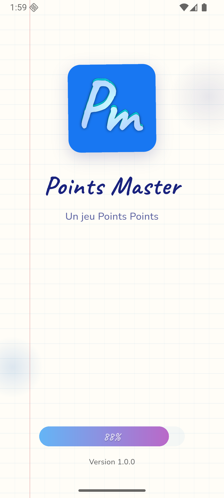
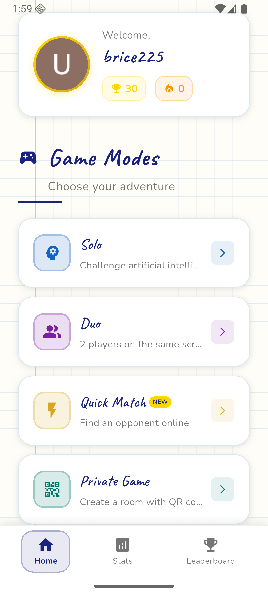
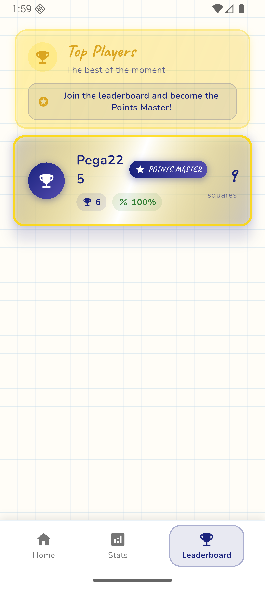
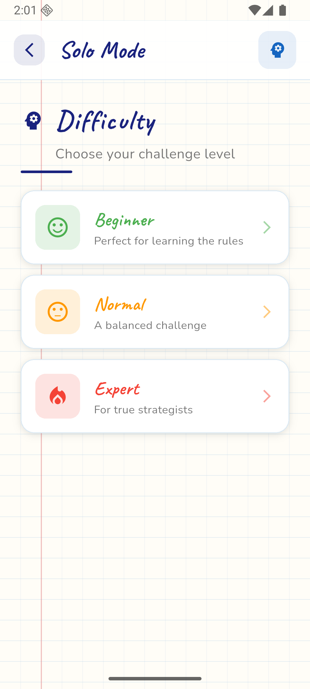
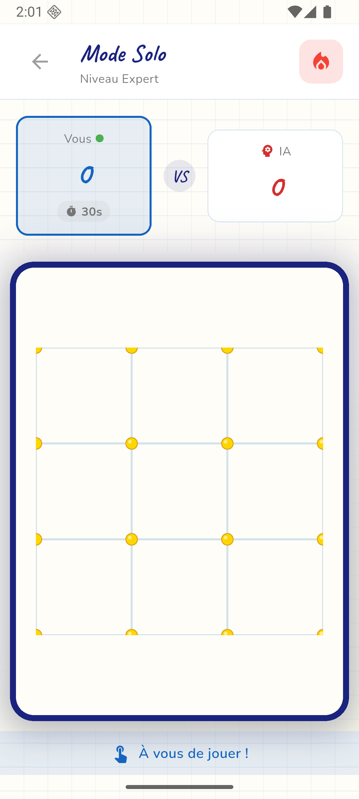

# 🎮 Points Master

<div align="center">


**Un jeu mobile compétitif de Points et Carrés développé avec Flutter**

[](https://flutter.dev)
[](https://dart.dev)
[](LICENSE)
[](https://flutter.dev)

</div>

---

## 📖 Description

**Points Master** est un jeu mobile moderne et compétitif inspiré du jeu classique de "Points et Carrés" que nous jouions sur nos cahiers quadrillés d'école. L'objectif est simple : tracer des lignes entre les points pour former des carrés. Chaque carré complété rapporte 1 point, et le joueur avec le plus de points remporte la partie !

Le jeu propose une expérience complète avec :
- 🎯 **Mode Solo** contre une IA intelligente avec différents niveaux de difficulté
- 👥 **Mode Multijoueur** en temps réel via Socket.IO
- 🎲 **Matchmaking automatique** pour trouver rapidement un adversaire
- 🔐 **Parties privées** via QR Code pour jouer avec vos amis
- 📊 **Classements et statistiques** détaillées
- 🏆 **Système de classement** global

---

## ✨ Fonctionnalités

### 🎮 Modes de Jeu

- **Solo** : Affrontez une IA avec 3 niveaux de difficulté (Facile, Normal, Expert)
- **Duo** : Jouez en local avec un ami sur le même appareil
- **Matchmaking** : Trouvez rapidement un adversaire en ligne
- **Partie Privée** : Créez ou rejoignez une partie via QR Code

### 🎨 Interface Utilisateur

- Design moderne inspiré des cahiers quadrillés d'école
- Animations fluides et transitions élégantes
- Thème personnalisable avec style "cahier"
- Support multilingue (Français, Anglais)
- Interface intuitive et accessible

### 📱 Fonctionnalités Sociales

- Authentification via Google Sign-In et Apple Sign-In
- Profils utilisateurs avec avatars personnalisés
- Classement global des meilleurs joueurs
- Statistiques détaillées (victoires, séries, scores)
- Historique des parties

### 🔔 Notifications

- Notifications push pour les invitations de partie
- Alertes de matchmaking
- Rappels de parties en attente
- Notifications personnalisables

### 💰 Monétisation

- Intégration AdMob pour les publicités
- Publicités interstitielles et natives
- Système de récompenses publicitaires

---

## 🛠️ Technologies Utilisées

### Frontend (Mobile)
- **Flutter** 3.8.1+ - Framework de développement multiplateforme
- **Dart** 3.8.1+ - Langage de programmation
- **Provider** - Gestion d'état
- **Socket.IO Client** - Communication temps réel
- **Firebase** - Authentification et notifications push
- **Google Mobile Ads** - Monétisation

### Backend
- **Laravel** - API REST
- **Filament** - Panel d'administration
- **Socket.IO** - Serveur WebSocket pour le temps réel
- **Redis** - Cache et gestion des sessions
- **MySQL/PostgreSQL** - Base de données

### Services
- **Firebase Authentication** - Authentification Google & Apple
- **Firebase Cloud Messaging** - Notifications push
- **AdMob** - Publicités
- **Google Fonts** - Typographie

---

## 📋 Prérequis

Avant de commencer, assurez-vous d'avoir installé :

- [Flutter SDK](https://flutter.dev/docs/get-started/install) (3.8.1 ou supérieur)
- [Dart SDK](https://dart.dev/get-dart) (3.8.1 ou supérieur)
- [Android Studio](https://developer.android.com/studio) ou [Xcode](https://developer.apple.com/xcode/) (pour iOS)
- [CocoaPods](https://cocoapods.org/) (pour iOS)
- Un compte Firebase configuré
- Un compte AdMob (optionnel, pour les publicités)

---

## 🚀 Installation

### 1. Cloner le repository

```bash
git clone https://github.com/uabogdev2/points-app.git
cd points-app
```

### 2. Installer les dépendances

```bash
flutter pub get
```

### 3. Configuration Firebase

1. Créez un projet Firebase sur [Firebase Console](https://console.firebase.google.com/)
2. Ajoutez vos applications Android et iOS
3. Téléchargez les fichiers de configuration :
   - `google-services.json` pour Android → placez-le dans `android/app/`
   - `GoogleService-Info.plist` pour iOS → placez-le dans `ios/Runner/`

### 4. Configuration AdMob (optionnel)

1. Créez un compte [AdMob](https://admob.google.com/)
2. Ajoutez votre application et obtenez votre App ID
3. Configurez l'App ID dans :
   - Android : `android/app/src/main/AndroidManifest.xml`
   - iOS : `ios/Runner/Info.plist`

### 5. Configuration de l'API Backend

Modifiez le fichier `lib/utils/config.dart` avec l'URL de votre API backend :

```dart
class ApiConfig {
  static const String baseUrl = 'https://votre-api.com/api';
}
```

### 6. Lancer l'application

#### Android
```bash
flutter run
```

#### iOS
```bash
cd ios
pod install
cd ..
flutter run
```

---

## 📁 Structure du Projet

```
lib/
├── main.dart                 # Point d'entrée de l'application
├── firebase_options.dart      # Configuration Firebase
├── models/                   # Modèles de données
│   ├── game.dart
│   ├── user.dart
│   └── ...
├── screens/                  # Écrans de l'application
│   ├── home_screen.dart
│   ├── game_screen.dart
│   ├── login_screen.dart
│   └── ...
├── widgets/                  # Widgets réutilisables
│   ├── game_board.dart
│   ├── notebook_widgets.dart
│   └── ...
├── providers/                # Gestion d'état (Provider)
│   ├── auth_provider.dart
│   ├── game_provider.dart
│   └── ...
├── services/                 # Services (API, Socket, etc.)
│   ├── api_service.dart
│   ├── socket_service.dart
│   ├── notification_service.dart
│   └── ...
├── theme/                    # Thème de l'application
│   └── app_theme.dart
└── utils/                    # Utilitaires
    └── config.dart
```

---

## 🎯 Règles du Jeu

### Objectif
Former des carrés complets en traçant des lignes entre les points adjacents. Chaque carré complété rapporte **1 point** au joueur qui l'a complété.

### Règles Principales

1. **Tour par tour** : Chaque joueur trace un seul segment par tour
2. **Carré complété** : Si un joueur complète un carré, il rejoue immédiatement
3. **Fin de partie** : La partie se termine quand tous les segments possibles sont tracés
4. **Victoire** : Le joueur avec le plus grand nombre de carrés remporte la partie

### Tailles de Grille Disponibles

- **3x3** : Partie rapide (9 carrés possibles)
- **5x5** : Partie standard (25 carrés possibles)
- **8x8** : Partie longue (64 carrés possibles)
- **12x12** : Partie marathon (144 carrés possibles)

---

## 🔧 Configuration Avancée

### Variables d'Environnement

Créez un fichier `.env` à la racine du projet (non versionné) :

```env
API_BASE_URL=https://votre-api.com/api
FIREBASE_PROJECT_ID=votre-project-id
ADMOB_APP_ID_ANDROID=ca-app-pub-xxxxx
ADMOB_APP_ID_IOS=ca-app-pub-xxxxx
```

### Build pour Production

#### Android
```bash
flutter build apk --release
# ou
flutter build appbundle --release
```

#### iOS
```bash
flutter build ios --release
```

---

## 📱 Captures d'Écran

<div align="center">

### Écran d'accueil et sélection de mode de jeu




### Interface de jeu




### Statistiques et classement




### Paramètres


</div>

---

## 🤝 Contribution

Les contributions sont les bienvenues ! Pour contribuer :

1. Fork le projet
2. Créez votre branche (`git checkout -b feature/AmazingFeature`)
3. Committez vos changements (`git commit -m 'Add some AmazingFeature'`)
4. Push vers la branche (`git push origin feature/AmazingFeature`)
5. Ouvrez une Pull Request

### Guidelines de Contribution

- Suivez les conventions de code Dart/Flutter
- Ajoutez des tests pour les nouvelles fonctionnalités
- Documentez votre code
- Assurez-vous que tous les tests passent

---

## 📝 Licence

Ce projet est sous licence MIT. Voir le fichier `LICENSE` pour plus de détails.

---

## 👥 Auteurs

- **Ulrich Abognon** - *Développement initial* - [uabogdev2](https://github.com/uabogdev2)

---

## 🙏 Remerciements

- Flutter Team pour le framework exceptionnel
- La communauté open-source pour les packages utilisés
- Tous les contributeurs qui ont aidé à améliorer ce projet

---

## 📞 Support

Pour toute question ou problème :

- 📧 Email : Support@ivoirelabs.com
- 🐛 Issues : [GitHub Issues](https://github.com/uabogdev2/points-app/issues)
- 💬 Discussions : [GitHub Discussions](https://github.com/uabogdev2/points-app/discussions)

---

## 🔮 Roadmap

- [ ] Mode tournoi
- [ ] Chat en jeu
- [ ] Système de récompenses
- [ ] Thèmes personnalisables
- [ ] Mode spectateur
- [ ] Replay des parties
- [ ] Intégration avec réseaux sociaux

---

<div align="center">

**Fait avec ❤️ en utilisant Flutter**

⭐ Si ce projet vous plaît, n'hésitez pas à lui donner une étoile !

</div>

